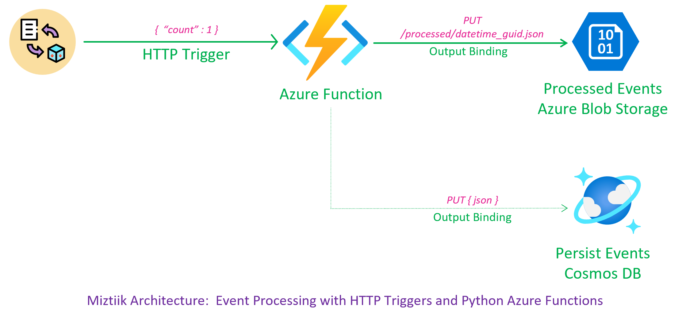
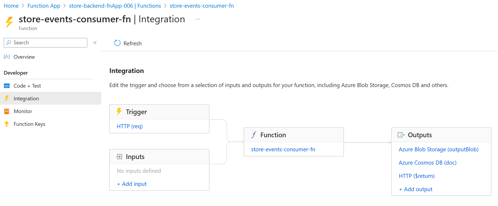
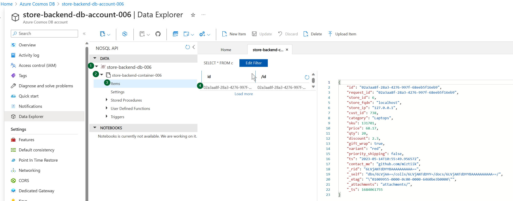
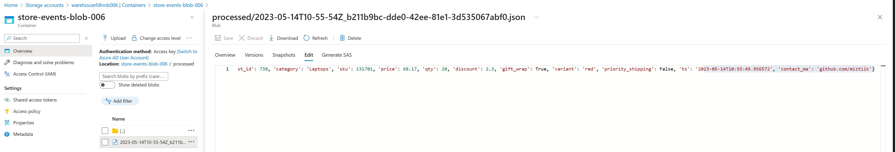

# HTTP Trigger Event for Azure Functions & store in CosmosDB

The developers at Mystique Unicorn [process files][6] as soon [as they arrive][7].They want to switch to an event-driven architecture. They were looking for a custom trigger, whether it be payload-based or time-based, to process files efficiently.

They heard about Azure's capabilities for user managed identities. Can you help them implement this event processing at Mystique Unicorn? 



## 🎯 Solution

Our solution enables seamless event processing using Azure Functions and [HTTP triggers][1]. With send a event payload to perform some action. For example, the payload could contain the name of a blob to be processed. The function can then retrieve the blob and process it accordingly. Our solution also includes an output binding to persist the processed event back to [Blob Storage][2] & also to [Cosmos DB][3].

By leveraging the power of Bicep, all necessary resources can be easily provisioned and managed with minimal effort. Our solution uses Python for efficient event processing, allowing for quick and easy deployment of sophisticated event processing pipelines.

1. ## 🧰 Prerequisites

   This demo, instructions, scripts and bicep template is designed to be run in `northeurope`. With few or no modifications you can try it out in other regions as well(_Not covered here_).

   - 🛠 Azure CLI Installed & Configured - [Get help here](https://learn.microsoft.com/en-us/cli/azure/install-azure-cli)
   - 🛠 Bicep Installed & Configured - [Get help here](https://learn.microsoft.com/en-us/azure/azure-resource-manager/bicep/install)
   - 🛠 VS Code & Bicep Extenstions - [Get help here](https://learn.microsoft.com/en-us/azure/azure-resource-manager/bicep/install#vs-code-and-bicep-extension)

1. ## ⚙️ Setting up the environment

   - Get the application code

     ```bash
     https://github.com/miztiik/azure-http-trigger-function-to-cosmos
     cd azure-http-trigger-function-to-cosmos
     ```

1. ## 🚀 Prepare the environment

   Let check you have Azure Cli working with 

    ```bash
      # You should have azure cli preinstalled
      az account show
    ```

    You should see an output like this,

   ```json
    {
      "environmentName": "AzureCloud",
      "homeTenantId": "16b30820b6d3",
      "id": "1ac6fdbff37cd9e3",
      "isDefault": true,
      "managedByTenants": [],
      "name": "YOUR-SUBS-NAME",
      "state": "Enabled",
      "tenantId": "16b30820b6d3",
      "user": {
        "name": "miztiik@",
        "type": "user"
      }
    }
   ```

1. ## 🚀 Deploying the application

   - **Stack: Main Bicep**
     This will create the following resoureces
     - General purpose Storage Account
        - This will be used by Azure functions to store the function code
     - Storage Account with blob container
        - This will be used to store the processed events
     - Python Azure Function
        - Input, Trigger, Output Binding to the blob container & Cosmos DB 
     - Cosmos DB
        - This will be used to store the processed events

      ```bash
      # make deploy
      sh deployment_scripts/deploy.sh
      ```

      After successfully deploying the stack, Check the `Resource Groups/Deployments` section for the resources.

      

1. ## 🔬 Testing the solution

   - **Upload file(s) to blob**

      Currently the function is designed to generate `1`` event as there a [limitaion on python bindings to blob & cosmos db][4]. If you do not know how many output blobs or cosmos items will be create by your function, then you will have to use the SDK instead of bindings.

      Sample bash script to upload files to blob container. You can also upload manually from the portal,
      ```bash
      # Set variables
      URL="https://store-backend-fnapp-006.azurewebsites.net/api/store-events-consumer-fn?count=1"
      $ curl $URL
      ```
      You should see an output like this,
      ```
      Processed Event: {"miztiik_event_processed": true, "msg": "", "count": 1, "resp": {"status": true, "tot_msgs": 1, "bad_msgs": 0, "sale_evnts": 0, "inventory_evnts": 1, "tot_sales": 68.17}, "last_processed_on": "2023-05-14T10:55:54.964561"}
      ```
      
      

      

     
1. ## 📒 Conclusion

    Here we have demonstrated how to use Azure functions triggered by HTTP events and persist data to blob and cosmosDB.
  

1. ## 🧹 CleanUp

If you want to destroy all the resources created by the stack, Execute the below command to delete the stack, or _you can delete the stack from console as well_

- Resources created during [Deploying The Application](#-deploying-the-application)
- _Any other custom resources, you have created for this demo_

```bash
# Delete from resource group
az group delete --name Miztiik_Enterprises_xxx --yes
# Follow any on-screen prompt
```

This is not an exhaustive list, please carry out other necessary steps as maybe applicable to your needs.

## 📌 Who is using this

This repository aims to show how to Bicep to new developers, Solution Architects & Ops Engineers in Azure.


### 💡 Help/Suggestions or 🐛 Bugs

Thank you for your interest in contributing to our project. Whether it is a bug report, new feature, correction, or additional documentation or solutions, we greatly value feedback and contributions from our community. [Start here](/issues)

### 👋 Buy me a coffee

[](https://ko-fi.com/Q5Q41QDGK) Buy me a [coffee ☕][900].

### 📚 References


1. [Azure Functions HTTP Trigger][1]
1. [Azure Blob Storage Ouput Binding][2]
1. [Azure Cosmos Ouput Binding][3]
1. [Azure Binding Limitations Issue][4]
1. [][5]
1. [Miztiik Blog - Blob Storage Event Processing with Python Azure Functions][6]
1. [Miztiik Blog - Blob Storage Processing with Python Azure Functions with HTTP Triggers][7]


[1]: https://learn.microsoft.com/en-us/azure/azure-functions/functions-bindings-http-webhook-trigger?tabs=python-v1
[2]: https://learn.microsoft.com/en-us/azure/azure-functions/functions-bindings-storage-blob-output?tabs=python-v1
[3]: https://learn.microsoft.com/en-us/azure/azure-functions/functions-bindings-cosmosdb-v2-output?tabs=python-v1%2Cin-process%2Cfunctionsv2&pivots=programming-language-python
[4]: https://github.com/MicrosoftDocs/azure-docs/issues/52575
[5]: 
[6]: https://github.com/miztiik/azure-blob-trigger-python-function
[7]: https://github.com/miztiik/azure-blob-input-binding-to-function


### 🏷️ Metadata


**Level**: 200


[100]: https://www.udemy.com/course/aws-cloud-security/?referralCode=B7F1B6C78B45ADAF77A9
[101]: https://www.udemy.com/course/aws-cloud-security-proactive-way/?referralCode=71DC542AD4481309A441
[102]: https://www.udemy.com/course/aws-cloud-development-kit-from-beginner-to-professional/?referralCode=E15D7FB64E417C547579
[103]: https://www.udemy.com/course/aws-cloudformation-basics?referralCode=93AD3B1530BC871093D6
[899]: https://www.udemy.com/user/n-kumar/
[900]: https://ko-fi.com/miztiik
[901]: https://ko-fi.com/Q5Q41QDGK